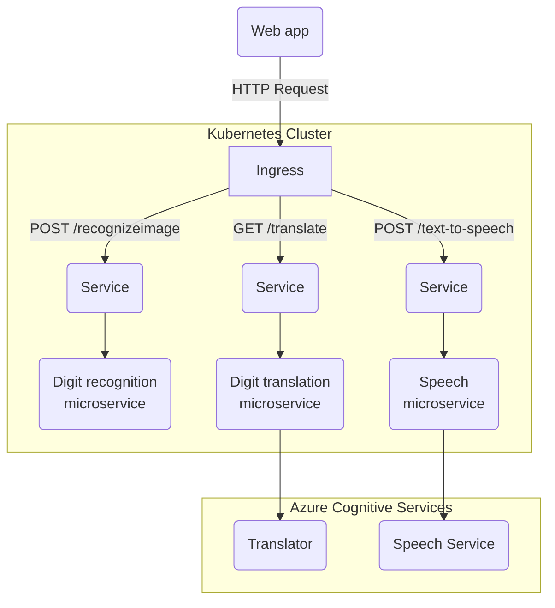
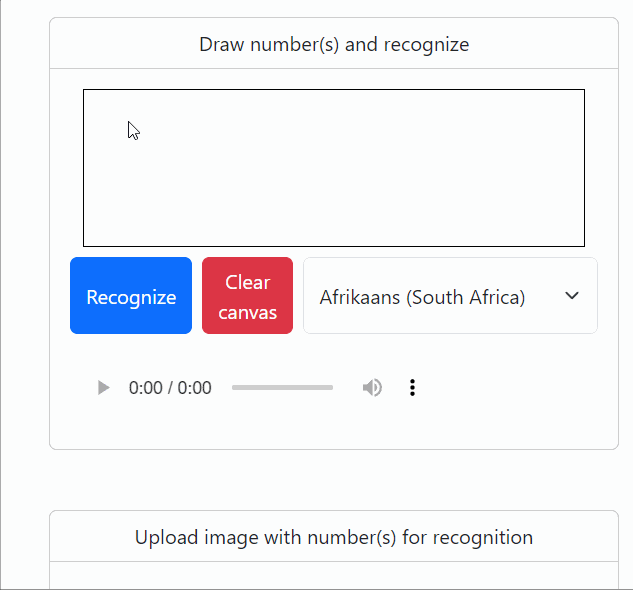
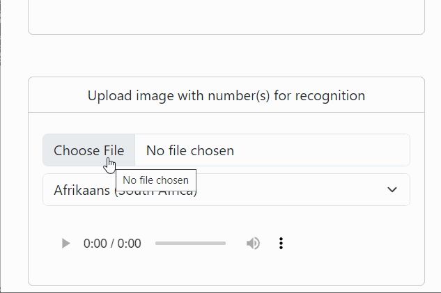

# Digit Recognition App

## Introduction

This project provides a set of microservices for digit recognition (from image), digit translation to text and text-to-speech service. All the microservices are designed to be deployed on a Kubernetes cluster and they can be tested locally using a simple web app and running the services on Minikube.

You can find detailed information of each of the microservice and the frontend web app in their respective README files.
- [Digit recognition microservice](./digit_recognition_microservice/README.md)
- [Digit translation microservice](./digit_translation_microservice/README.md)
- [Speech microservice](./speech_microservice/README.md)
- [Web app](./frontend_web_app/README.md)

## Architecture

The microservices are designed to be deployed on a Kubernetes cluster using the following architecture:

In this architecture, the Web app sends HTTP requests to the Ingress, which routes the requests to the appropriate backend Service based on the request path. The backend Services are implemented as Kubernetes Services, that connect to the pods based on the used port. The backend Pods are implemented as Kubernetes Deployments, which run the microservices.

The microservices are implemented as follows:

- The Digit recognition microservice receives an image of a handwritten digit(s) and returns the recognized digits as an array of numbers, such as [1,2,3]
- The Digit translation microservice receives an array of digits and returns the translated string in a chosen language. It uses a JS library to turn the array into english text and Azure Translator to translate it to chosen language.
- The Speech microservice receives a string of text and returns an audio file of the text being spoken, with chosen language. The audio is generated by Azure Speech Service.

The web app provides minimal amount of tools to test that the microservices are working. You can draw the digit(s) on a HTML canvas or upload an image file that has hand written numbers. There is also a selection for a langugage that the translation and audio will be done. 

Upon pressing "Recognize" or finishing upload, the canvas drawing or image will be sent to the digit recognition microservice, which will return the recognized numbers back to the web app, which will then forward it automatically to the next service, digit translation microservice. The digit translation will take the array of digits and language selection as an input, then it will produce a written number in a selected language. For example [1,2,3,4] in english -> "one thousand, two hundred thirty-four". This string and language code will be sent to the speech microservice, that will turn the text to an audio file, send it back to the UI that will be automatically play it.

## Requirements

To run the digit recognition app locally, you will need the following software installed:

- [Docker](https://www.docker.com/)
- [Minikube](https://minikube.sigs.k8s.io/docs/start/)
- [kubectl](https://kubernetes.io/docs/tasks/tools/)

## Usage

To deploy the microservices on a Kubernetes cluster, follow these steps:

1. Start Minikube: `minikube start`
2. Build the Docker images for each microservice and deploy them. See instructions for invidual services
    - [Digit recognition microservice](./digit_recognition_microservice/README.md)
    - [Digit translation microservice](./digit_translation_microservice/README.md)
    - [Speech microservice](./speech_microservice/README.md)
3. Enable minikube ingress addon: `minikube addons enable ingress`
4. Deploy the Kubernetes Ingress: `kubectl apply -f ingress.yaml`
5. Start tunnel so you can access the kubernetes through ingress: `minikube tunnel`
6. Run digit_recognition_app.html in web browser and test the microservices using the UI tools it provides

## Demo

Here I draw on canvas, select language and test that the microservices are up and running by hitting "Recognize". First the digit recognition microservice responds what numbers were recognized, such as 1, 2, 3, 4, 5. The app will automatically forward these numbers to digit translation microservice, which should return a text translation of the numbers, such as "twelve thousand three hundred and forty-five". This will then be automatically forwarded to speech microservice, which responds with audio file, that will be played in the browser.

In this demo, I do similar test, but this time with uploaded images.

## License

This project is licensed under the MIT License.