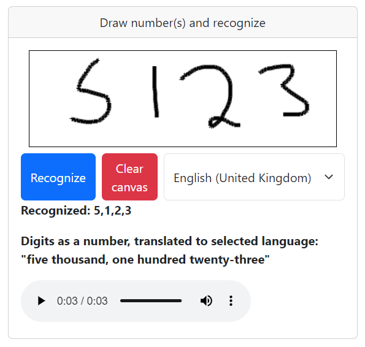
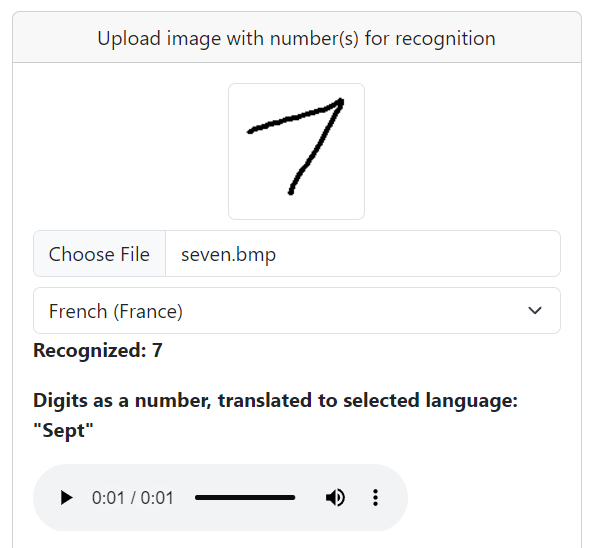
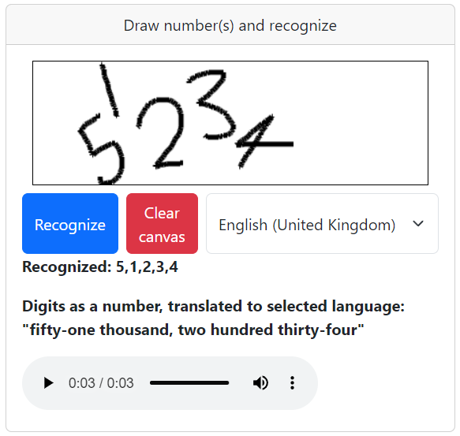
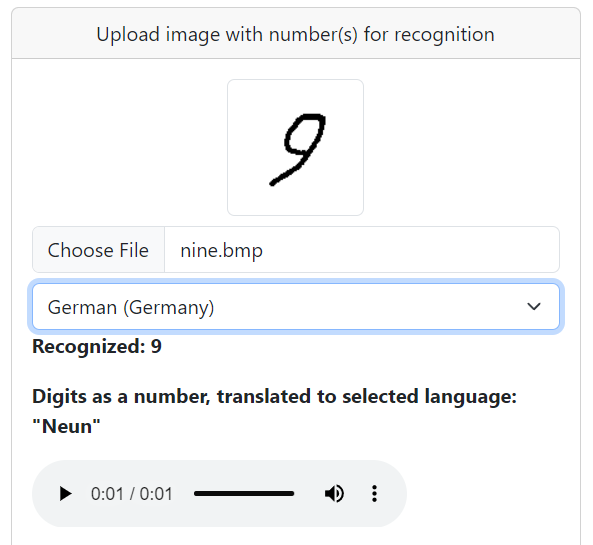

# Digit recognition web app




This is a web application used to test all the microservices in this project. You can run it in any browser you want, it is simple HTML, JS with Bootstrap styling, all in one file.

It is not necessary to modify it, unless your minikube or other microservice set up is different than the default used in this project. In this case, look for lines 250-252 to modify appropriate microservice addresses:
```
var digitRecognitionServiceAddress = "http://localhost";
var digitTranslationServiceAddress = "http://localhost";
var speechServiceAddress = "http://localhost";
```

## Usage

There is two options for testing the microservices. One is for drawing the numbers by yourself in the canvas element. The other option is to upload image from your computer.

### Drawing on canvas

1. Draw any amount of digits you like on the canvas. It is not too picky on the size or position.
2. Choose language from the select-element.
3. Hit "Recognize"
4. Wait couple seconds for the outcome.
    - You can see the first text "Recgonized: X, X, X" text. That came from the digit recognition microservice.
    - The text below it "Digits as a number, translated to selected language: 'xxxxxxx'" was the response from digit translation microservice.
    - At the bottom there is an audio player. It should start automatically to play the audio speech, that says the same as text above it. You can play it again, or download it as mp3 file.

Example of the outcome:


### Uploading an image

1. Choose language from the select-element.
2. Click "Choose file".
3. Select and upload any image file from your computer, that contains digit(s). All the commonly used are supported, such as bmp, png, jpg.
4. Wait couple seconds for the outcome.
    - You can see the first text "Recgonized: X, X, X" text. That came from the digit recognition microservice.
    - The text below it "Digits as a number, translated to selected language: 'xxxxxxx'" was the response from digit translation microservice.
    - At the bottom there is an audio player. It should start automatically to play the audio speech, that says the same as text above it. You can play it again, or download it as mp3 file.

Example of the outcome:

